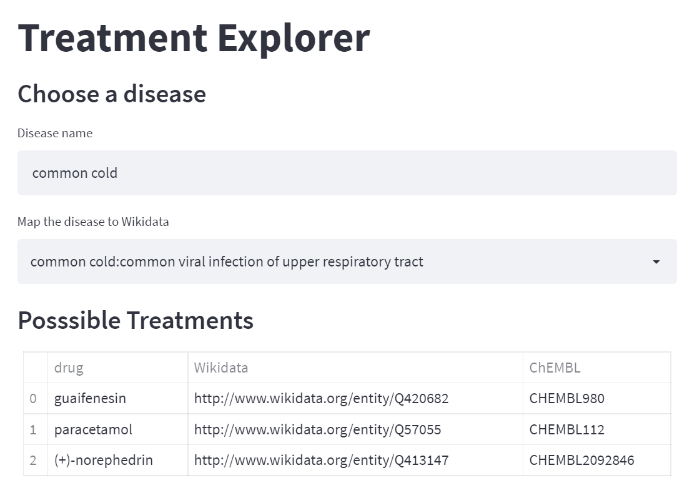

# Treatment Explorer

An application leveraging the knowledge present in Wikidata by SPARQL queries

Accompanying the blog post: [Building an application leveraging Wikidata](https://medium.com/@gokceuludogan/building-an-application-leveraging-wikidata-3f7ce9d6933b)



## Requirements

```
SPARQLWrapper
pandas
streamlit
streamlit-agraph
```

## Usage

```
python app.py
```
